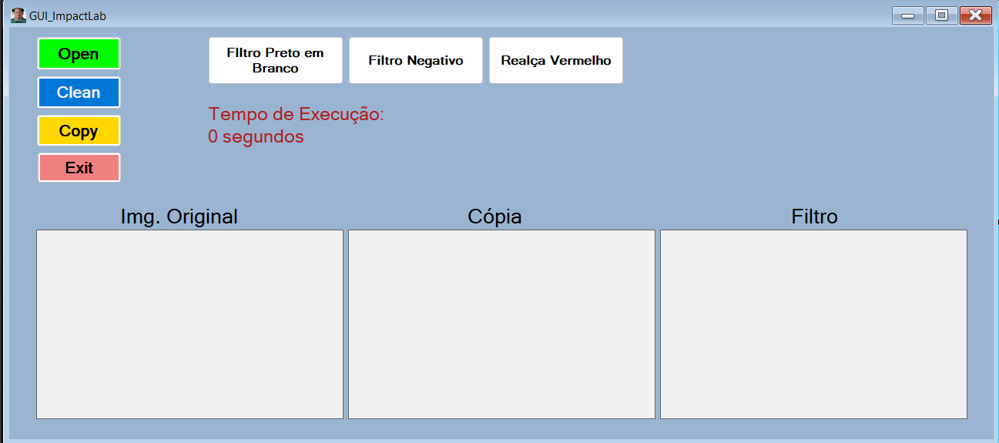
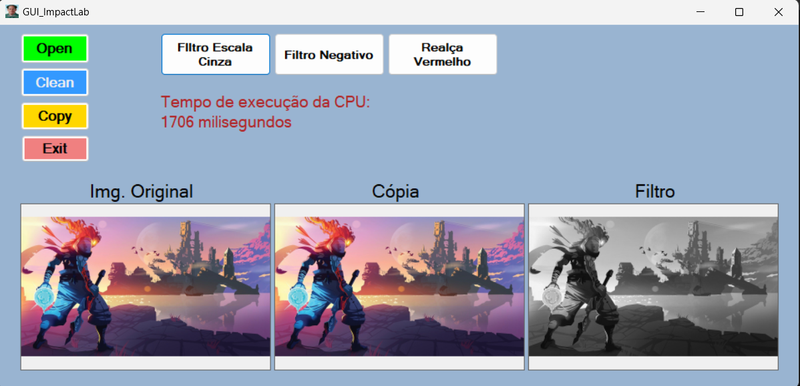

# ImpactLab GUI - Image Processing with C++/CLI

This project is a graphical user interface (GUI) application developed in C++/CLI for image processing tasks. The application allows users to apply various filters to images and measure the CPU execution time of these operations.

## Features

- **Open**: Load an image into the application.
- **Clean**: Reset the image fields to their default state.
- **Copy**: Duplicate the original image into the copy section.
- **Exit**: Close the application.
- **Filtro Preto em Branco**: Convert the image to black-and-white.
- **Filtro Negativo**: Apply a negative filter to the image.
- **Realça Vermelho**: Enhance the red tones in the image.
- **CPU Execution Time**: Displays the time taken by the CPU to process the selected filter.

## GUI Overview



### Layout Description

- **Original Image**: Displays the loaded image.
- **Cópia**: Shows a duplicate of the original image.
- **Filtro**: Shows the filtered image after applying one of the available filters.

## Installation and Setup

1. **Clone the repository**:
   ```bash
   git clone https://github.com/Alex1105br/ImpactLab-GUI---Image-Processing-with-C-CLI.git
   cd impactLab-gui
   ```

2. **Open the project in Visual Studio**:
   - Ensure that you have Visual Studio installed with C++/CLI components.
   - Open the solution file (`.sln`) in Visual Studio.

3. **Build the project**:
   - Select `Release` or `Debug` mode.
   - Build the solution to generate the executable.

4. **Run the application**:
   - Execute the built program to launch the GUI.

## Usage

1. Click **Open** to load an image.
2. Use the **Copy** button to duplicate the image.
3. Apply any of the available filters by clicking the respective buttons.
4. View the CPU execution time for each filter operation.
5. Use the **Clean** button to reset the image fields if needed.
6. Click **Exit** to close the application.

## Example

The following is an example of how the GUI looks when an image is loaded and a black-and-white filter is applied.




---

